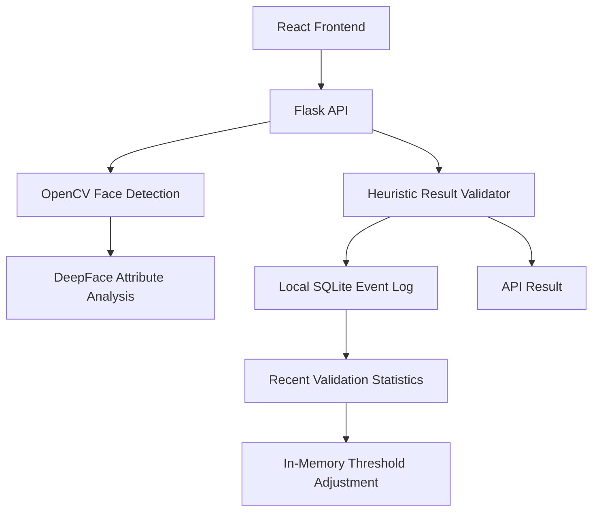

# Face Detection Web App

A Flask and React application for OpenCV-based face detection with optional DeepFace emotion, age, and gender analysis. It applies heuristic result checks, records local validation events in SQLite, and adjusts a validation confidence threshold in memory. The lightweight/free deployment runs OpenCV detection only; the Docker deployment enables DeepFace analysis when its models load successfully.

This application does **not** train, fine-tune, replace, or deploy model weights. Its feedback data is not a labeled training set.

[](https://python.org)
[](https://react.dev/)
[](https://flask.palletsprojects.com/)
[](LICENSE)

## Features

### Face detection and analysis

- OpenCV Haar-cascade face detection
- DeepFace emotion, age, and gender estimates when analysis dependencies are available
- OpenCV-only detection fallback for lightweight/free deployments
- Optional eye-cascade check for detected face regions
- Flask JSON API and local React/Vite interface
- Model preloading and readiness monitoring

### Heuristic validation and local feedback

- Rule-based confidence, size, age-range, consistency, and outlier checks
- Local SQLite log of prediction and validation events
- Recent-event statistics for monitoring
- In-process confidence-threshold adjustment bounded between `0.4` and `0.8`
- Recommendation signal when recent heuristic acceptance is low

The `accepted` value means that a prediction passed the application's own heuristic rules. It is not a human label and must not be interpreted as measured accuracy.

## Quick start

### Prerequisites

- Python 3.11 or newer
- Node.js `^20.19.0` or `>=22.12.0` (required by Vite 8)
- npm

`start.sh` checks the Node.js version and installs DeepFace, TensorFlow, and the frontend dependencies. For manual setup, install DeepFace and TensorFlow explicitly as shown below for full analysis. Without them, `/ready` reports `degraded` and `/detect` remains available using OpenCV-only detection; model preload failures use the same degraded behavior.

### One-command setup

```bash
git clone https://github.com/Param-10/FaceDetection_App.git
cd FaceDetection_App
chmod +x start.sh
./start.sh
```

The script installs dependencies, starts the Flask API on port `5050`, and starts the Vite frontend on port `3000` (or `3001` if needed).

### Manual setup

```bash
git clone https://github.com/Param-10/FaceDetection_App.git
cd FaceDetection_App

python3 -m venv venv
source venv/bin/activate
python -m pip install -r requirements.txt

# Optional full-analysis dependencies; omit for OpenCV-only mode
python -m pip install deepface tensorflow

npm install
```

Run the services in separate terminals:

```bash
# Terminal 1
source venv/bin/activate
python app.py
```

```bash
# Terminal 2
npm run start
```

## Deploy

For a single-service Render deployment that serves both the API and frontend, see [`DEPLOYMENT.md`](DEPLOYMENT.md).

---

## System architecture


```mermaid
graph TB
    A[React Frontend] --> B[Flask API]
    B --> C[OpenCV Face Detection]
    C --> D[DeepFace Attribute Analysis]
    B --> E[Heuristic Result Validator]
    E --> F[Local SQLite Event Log]
    F --> G[Recent Validation Statistics]
    G --> H[In-Memory Threshold Adjustment]
    E --> I[API Result]
```

The feedback loop changes only a runtime validation threshold. It has no model-training component.

## API

### Detect faces

```http
POST /detect
Content-Type: multipart/form-data
```

Example response shape:

```json
{
  "image": "data:image/jpeg;base64,...",
  "faces": [
    {
      "box": [150, 100, 300, 250],
      "confidence": 0.78,
      "emotion": "happy",
      "age": 25,
      "gender": "Female"
    }
  ],
  "metadata": {
    "validation_score": 0.85,
    "is_valid": true,
    "issues": [],
    "should_retrain": false,
    "analysis_available": true,
    "num_faces_detected": 1,
    "detection_quality": "high"
  }
}
```

`should_retrain` is a legacy field name for a recommendation bit. Setting it does not start or perform retraining.

### Health and readiness

```http
GET /health
GET /ready
```

### Validation dashboard

```http
GET /dashboard
```

The dashboard reports recent events from the local database, the current in-memory thresholds, recommendation text, and the legacy `should_retrain` recommendation bit. It does not report ground-truth accuracy.

## How validation and threshold adjustment work

For every detection request, the backend:

1. Detects candidate boxes with OpenCV.
2. Applies face-quality and optional eye-cascade filters.
3. Runs DeepFace attribute analysis when available.
4. Applies the heuristic result validator.
5. Appends one validation event to `model_data/model_feedback.db`.
6. Uses recent logged events to adjust the in-memory confidence threshold.
7. Returns only results accepted by the heuristic validator.

The confidence threshold starts at `0.6`. After an event is logged with a UTC timestamp, statistics from the preceding 14 UTC days are evaluated. Legacy timezone-naive events are excluded from these rolling calculations because their original UTC offset cannot be reconstructed safely:

- If heuristic acceptance is greater than `0.90`, multiply the threshold by `1.02`.
- If heuristic acceptance is less than `0.70`, multiply the threshold by `0.98`.
- Otherwise, leave it unchanged.
- Clamp the result to the range `0.4`–`0.8`.

The threshold is process-local and is not persisted. It resets to `0.6` when the backend restarts.

Because the controller uses the validator's own acceptance decisions as feedback, it can reinforce errors made by those rules. It is a simple runtime control loop, not model learning.

## Feedback storage and privacy

The application creates `model_data/model_feedback.db` on startup. The `predictions` table records:

- UTC timestamp for new events (legacy timezone-naive events are retained but excluded from rolling windows);
- an MD5 hash of the decoded image pixels;
- face count and per-event average face confidence (`0` for no-face events);
- serialized prediction objects, including bounding boxes and any inferred attributes;
- validation score and heuristic acceptance decision;
- feedback source, which is `auto` for current detections.

The current implementation does not save uploaded image files, filenames, user-provided labels, or raw image bytes. The MD5 is an event fingerprint only; it is not anonymization or a security control. A `model_stats` table is created by the schema but is not populated by the current code.

Runtime `model_data/` contents are ignored by Git. The old database is currently still recoverable from the public repository history (introduced in commit `15dd792`); removing the current file does not remove that historical blob.

Before deploying this application with real faces, add an explicit consent/privacy notice, a retention policy, access controls for the database, and a deletion mechanism appropriate to your jurisdiction and use case.

## Retraining recommendation semantics

The `should_retrain` field is set when both conditions are true:

- more than 50 timezone-aware events exist in the preceding 7 UTC days; and
- fewer than 80% of those events passed the heuristic validator.

It is only a signal for a developer or operator to investigate. There is no automated retraining pipeline, labeled dataset, model update, or model replacement in this repository.

## Technology stack

### Backend

- Flask
- OpenCV
- NumPy
- SQLite
- DeepFace and TensorFlow for full attribute analysis; OpenCV-only mode works without them

### Frontend

- React 18
- Vite
- Tailwind CSS
- Framer Motion
- Lucide React

## Monitoring

```bash
curl http://localhost:5050/health
curl http://localhost:5050/ready
curl http://localhost:5050/dashboard
./check_readiness.sh
```

Run the validation and feedback demo:

```bash
python demo_autonomous_learning.py
```

The demo filename is retained for compatibility; the script exercises validation, local event logging, threshold adjustment, and recommendation reporting. It does not train a model.

To discard local validation history, stop the backend and remove the generated directory:

```bash
rm -rf model_data/
```

The next backend startup recreates it.

## Project structure

```text
FaceDetection_App/
├── app.py
├── face_detection_model.py
├── requirements.txt
├── demo_autonomous_learning.py
├── AUTONOMOUS_LEARNING_GUIDE.md
├── check_readiness.sh
├── start.sh
├── Dockerfile
├── render.yaml
├── requirements-deploy.txt
├── DEPLOYMENT.md
├── src/
│   ├── App.jsx
│   ├── components/
│   ├── index.css
│   └── main.jsx
├── index.html
├── package.json
├── package-lock.json
├── tailwind.config.js
└── vite.config.js
```

See [`AUTONOMOUS_LEARNING_GUIDE.md`](AUTONOMOUS_LEARNING_GUIDE.md) for implementation-level details. Its filename is also retained for compatibility; the current content describes feedback-driven validation tuning.

## License

This project is licensed under the [MIT License](LICENSE).
